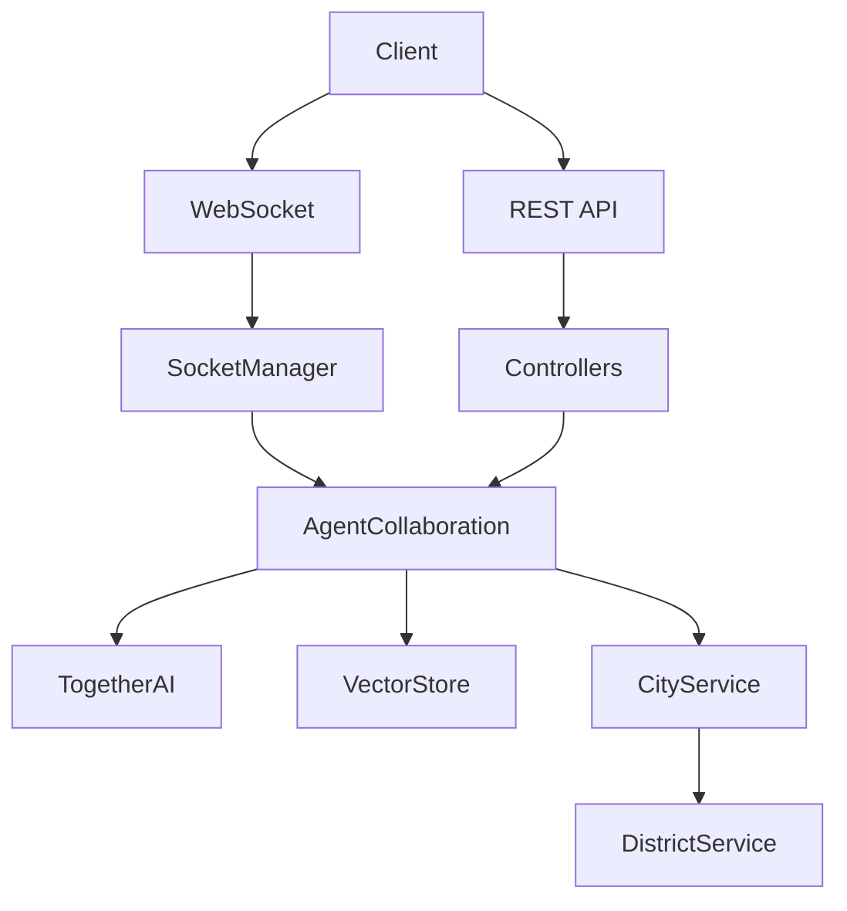

# AI City Management System

A sophisticated backend system for managing an AI-powered smart city, featuring intelligent agents, real-time event handling, and district management.

## 🌟 Features

### 🤖 Intelligent Agents

- **Specialized AI Agents**: Each agent has unique traits and expertise areas
  - Urban Planning (Sophia Chen)
  - Transportation Systems (Marcus Rivera)
  - Environmental Protection (Olivia Green)
  - Smart Infrastructure (Raj Patel)
  - Community Wellness (Elena Santos)
- **Dynamic Interactions**: Agents collaborate and respond to city events
- **Contextual Awareness**: Responses adapt to city state and events
- **Memory & Learning**: Vector-based memory system for context retention

### 🏙️ Smart City Management

- **District Monitoring**: Real-time tracking of district metrics
  - Population density
  - Noise levels
  - Safety metrics
  - Environmental conditions
- **Event Handling**: Automated response to city events
- **Resource Management**: Track and optimize city resources

### 🤝 Collaboration System

- **Real-time Sessions**: WebSocket-based collaboration between agents
- **Decision Making**: Collective decision synthesis
- **Event Propagation**: Smart event distribution across districts
- **Context Awareness**: Vector-based similarity search for relevant information

## 🛠️ Technical Architecture

### Core Services

- `TogetherService`: AI model integration
- `VectorStoreService`: Embedding and similarity search
- `ConversationService`: Agent communication
- `CityService`: City state management
- `DistrictService`: District management
- `AgentCollaborationService`: Multi-agent coordination
- `SocketManagerService`: Real-time communication

### Key Components

- **AI Integration**: Together AI for language model capabilities
- **Vector Store**: Pinecone for semantic search
- **WebSocket**: Real-time updates and collaboration
- **Event System**: Node.js EventEmitter based architecture

## 📁 Project Structure

```
src/
src/
├── config/
│ ├── city-agents.ts # Agent configurations
│ └── ...
├── controllers/
│ ├── agent.controller.ts
│ ├── collaboration.controller.ts
│ └── ...
├── services/
│ ├── agent-collaboration.service.ts
│ ├── city.service.ts
│ ├── district.service.ts
│ ├── together.service.ts
│ └── ...
├── types/
│ ├── agent.types.ts
│ ├── city-events.ts
│ ├── district.types.ts
│ └── ...
└── utils/
└── city-context.ts
```

## 🚀 Getting Started

### Prerequisites

- Node.js 16+
- Bun runtime
- Together AI API key
- Pinecone API key

### Installation

1. Clone the repository

```bash
git clone <repository-url>
cd ai-city-management
```

2. Install dependencies

```bash
bun install
```

3. Configure environment variables

```bash
cp .env.example .env
```

Edit `.env` with your API keys:

```env
TOGETHER_API_KEY=your_together_api_key
PINECONE_API_KEY=your_pinecone_api_key
```

4. Start the development server

```bash
bun run dev
```

## 📚 API Documentation

### Agent Endpoints

```typescript
// Get all agents
GET /agents

// Get specific agent
GET /agents/:id

// Send message to agent
POST /agents/message
{
  "agentId": "string",
  "content": "string",
  "conversationId": "string"
}

// Initiate agent collaboration
POST /agents/collaborate
{
  "agents": ["agentId1", "agentId2"],
  "topic": "string"
}
```

### City Management

```typescript
// Get city status
GET /city/status

// Create city event
POST /city/events
{
  "type": "CityEventCategory",
  "title": "string",
  "description": "string",
  "severity": number,
  "affectedDistricts": ["string"]
}

// Get district information
GET /districts/:id
```

### Collaboration

```typescript
// Start collaboration session
POST /collaborate/initiate
{
  "eventId": "string",
  "agents": ["string"],
  "initialContext": "string"
}

// WebSocket connection
WS /collaborate/session/:sessionId

// Get session status
GET /collaborate/status/:sessionId
```

## 🧪 Testing

Run the test suite:

```bash
bun test
```

Run specific tests:

```bash
bun test services
bun test controllers
```

## 🔧 Development

### Code Style

We use ESLint and Prettier for code formatting:

```bash
# Run linter
bun run lint

# Format code
bun run format
```

### Type Checking

```bash
# Run TypeScript compiler
bun run typecheck
```

## 📦 Dependencies

Core dependencies:

- `@elysiajs/websocket`: WebSocket support
- `together-ai`: AI model integration
- `@pinecone-database/pinecone`: Vector database
- `node-schedule`: Task scheduling

Dev dependencies:

- `typescript`: Type checking
- `eslint`: Code linting
- `prettier`: Code formatting
- `bun-types`: Bun runtime types

## 🤝 Contributing

1. Fork the repository
2. Create your feature branch (`git checkout -b feature/amazing-feature`)
3. Commit your changes (`git commit -m 'Add amazing feature'`)
4. Push to the branch (`git push origin feature/amazing-feature`)
5. Open a Pull Request

### Commit Guidelines

We follow conventional commits:

- `feat:` New features
- `fix:` Bug fixes
- `docs:` Documentation changes
- `refactor:` Code refactoring
- `test:` Adding or modifying tests

## 🙏 Acknowledgments

- Together AI for providing the language model capabilities
- Elysia.js team for the web framework
- Bun team for the runtime environment
- Pinecone for vector database capabilities

## 📞 Support

For support:

- Open an issue in the repository

## 📊 System Architecture



## ⚡ Performance

- Response Time: <100ms for agent responses
- WebSocket Latency: <50ms
- Vector Search: <200ms
- Event Propagation: Real-time
